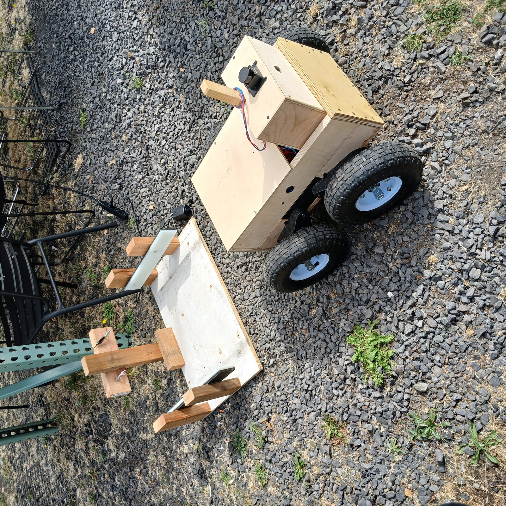

# eLlama

A four-wheel-drive outdoor robot platform, walking-speed, that ships as a complete working robot and doubles as a mount for teleoperated or autonomous compute.

Demo video: **[youtu.be/O5k8u-hmhis](https://youtu.be/O5k8u-hmhis)**. Try the 3D drive simulator without installing anything, hosted on Hugging Face Spaces: **[huggingface.co/spaces/r5d2/ellama-simulator](https://huggingface.co/spaces/r5d2/ellama-simulator)**.

## Who it's for

People who know they will want a capable outdoor robot in three to five years, and want something to iterate on now, before they buy the real one. Software, sensing, and autonomy ideas get tested on a robot that is cheap, repairable, and driven outdoors for real, so the ideas are proven by the time the commercial platform is worth buying.

The design leans on that. eLlama supplies only the slow-moving parts (motors, gearboxes, wheels, plywood, an ESP32, and a radio protocol) and leaves the fast-moving part, the computer, camera, and model, to the owner, in a box sized to take whatever comes next. The reasoning is in [`context-pack/01-overview.md`](context-pack/01-overview.md).

## Specs

| | |
| --- | --- |
| Drive | 4 x RS550 brushed motors, 100:1 gearboxes, 10 in pneumatic wheels |
| Power | 12 V system: one or two 12 V 7 Ah sealed lead-acid batteries in parallel |
| Motor drivers | 4 x BTS7960 |
| Control | ESP32 (Llama Motor Board), ESP-NOW handheld controller or USB serial bridge to a computer |
| Sensing | AS5600 wheel encoders, IMU (GY-521 / MPU-6050 / ICM-20948 sketches) |
| Charging | Passive dock: drive in, pogo pins meet contacts, dumb 12 V charger runs |
| Weight | About 32 lb dry, 37 lb with one battery, 42 lb with two |

## Status

**Works:** manual and remote driving, docking by driving in, encoder and IMU telemetry, encoder-closed-loop moves ("go forward 10 inches") from Python or an AI agent through the MCP server, camera and lidar streaming over the network, and the calibrated simulators. Over 13 miles of field runs are logged in [`context-pack/Testing.csv`](context-pack/Testing.csv), failures included.

**Not there yet:** obstacle sensing, an emergency stop beyond the power switch, and self-finding of the dock. Until obstacle sensors exist, anything commanding the robot must follow [`DRIVING_POLICY.md`](DRIVING_POLICY.md).

## Repo layout

| Path | What's there |
| --- | --- |
| [`context-pack/`](context-pack/) | Design docs and the [user manual](<context-pack/eLlama User Manual.md>) |
| [`firmware/`](firmware/) | ESP32 Arduino sketches (controller, motor board, bridge) |
| [`teleop/`](teleop/) | Python client/server scripts for driving, video, and lidar over the network |
| [`calibration/`](calibration/) | Sensor validation and calibration tools that read the computer bridge: live encoder/IMU view and calibration |
| [`mcp_server/`](mcp_server/) | MCP server so an AI agent can drive the robot by encoder feedback ("go forward 10 inches") instead of guessing a duration |
| [`simulation/`](simulation/) | Calibrated 2D/3D drive-command simulators and a CSV replay script |
| [`images/`](images/) | Photos and diagrams |

## License

Released under the [MIT License](LICENSE).
