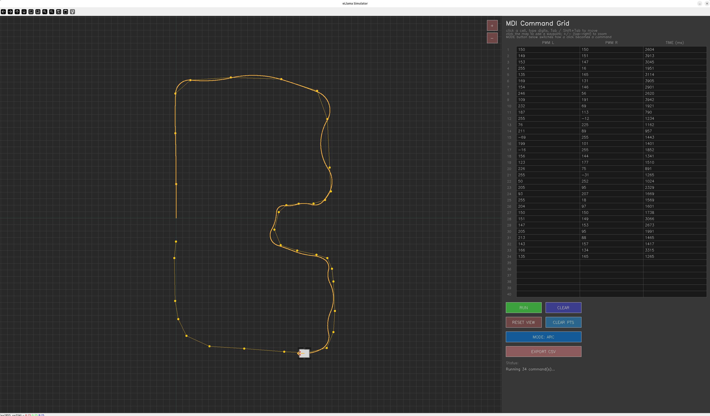
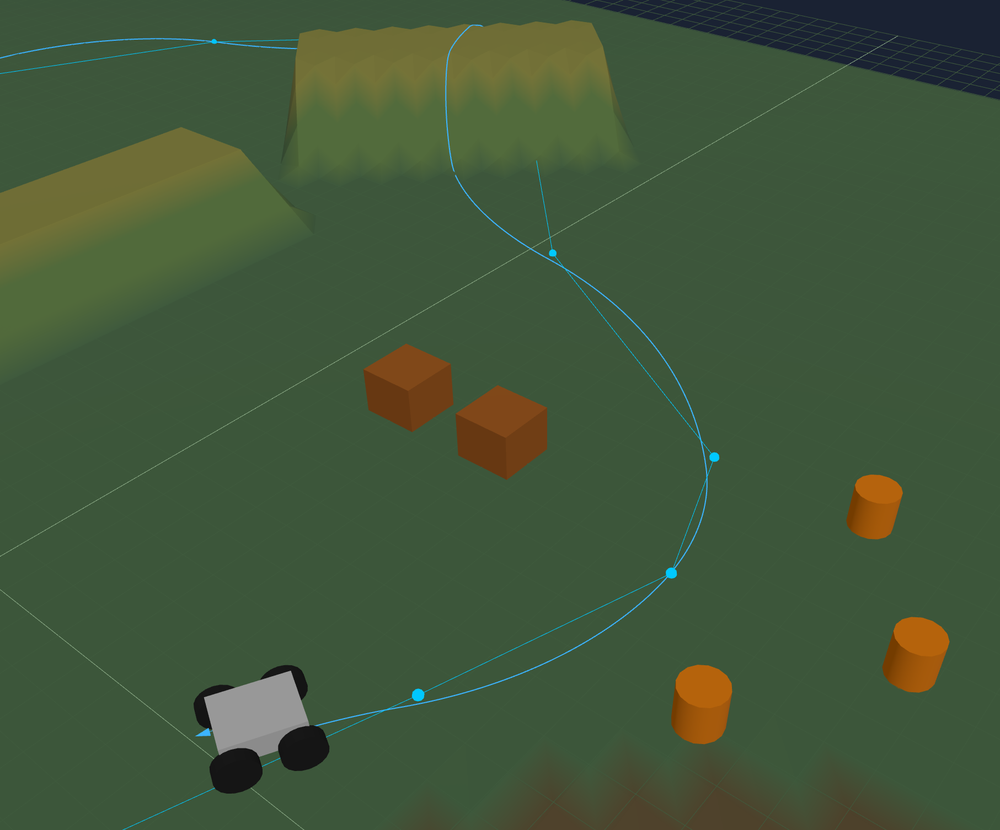

# Simulation

Path planning and dry-run simulators for eLlama's open-loop drive commands (`pwml pwmr time_ms`, the same three numbers the firmware's `DrivePacket{left, right}` and `esp_bridge.ino` expect). Two UIs, each with a "simple" and a "complex" version:

| Script | UI | Input |
| --- | --- | --- |
| [`simulator.py`](simulator.py) | OpenCV, top-down 2D | Free-text MDI box, one `pwml pwmr time_ms` line per command |
| [`simulator_complex.py`](simulator_complex.py) | OpenCV, top-down 2D | Editable MDI grid, plus click-to-add waypoints (turn-then-drive or arc mode) |
| [`simulator3d.html`](simulator3d.html) | Browser, 3D (three.js) | Same free-text MDI box as `simulator.py` |
| [`simulator3d_complex.html`](simulator3d_complex.html) | Browser, 3D (three.js) | Same grid + click-to-waypoint planning as `simulator_complex.py` |

Run a Python one with `python3 simulator_complex.py`; open an `.html` one directly in a browser, no server needed.




## Why this is more than a toy

eLlama has no wheel encoders or other odometry feedback — commands are pure open-loop PWM + duration. To make the simulator worth trusting, I drove the real robot with simple commands (e.g. `120 -120 1800`), measured the actual distance/turn on the ground, and calibrated the simulator's speed and turn-rate model to match those measurements (see the `_SPEED_PTS` and `TURN_SCRUB_FACTOR` comments at the top of each script). The result: for a reasonable command like `150 150 2000`, the path drawn in the simulator tracks what the robot actually does closely enough to plan with.

Because there's no feedback, error still accumulates over a run, and it shows up most on turns (skid-steer scrubs unpredictably). Straight-line forward/back commands are the reliable case — under about 8 ft of travel, the robot usually lands within a fraction of an inch of the simulated endpoint. That's good enough to plan multi-step paths in the simulator, export them, and expect the real robot to follow along.

## Safety: MAX PWM is required, and there's no default on purpose

Every UI has a **MAX PWM** field. RUN and EXPORT CSV both refuse to act until it's set, and once it is, every command's `(pwml, pwmr)` pair is scaled down — preserving the ratio between them, so a turn's shape doesn't change, only its speed — so neither wheel exceeds it.

There's deliberately no baked-in default. The first version of this tool didn't have this control, and the click-to-waypoint arc planner (which picks whatever PWM gets to the clicked point at a steady speed) happily wrote out full-throttle 255 commands on tight turns — accurate to what the robot actually did, just much faster than expected the first time it ran unattended. That's a general risk, not specific to this planner: AI-assisted or auto-generated motion code tends to reach for whatever value produces the desired motion fastest, which in an unconstrained PWM range usually means near-maximum. **Start with the lowest PWM that's still effective for what you're testing, watch it run, and only raise the ceiling once you trust the path** — don't hand a fresh command list to the real robot at whatever PWM it happened to be written with.

Separately: PWM magnitudes much below ~40 tend not to produce any real motion at all — that's mechanical (motor/gearbox static friction), not a firmware-enforced deadband, so the simulator won't warn you about it. A command with `|pwm|` in the single or low double digits may look fine in the preview and simply do nothing on the real robot.

## Workflow

1. Build a path in the simulator — type commands directly, or click the ground to drop waypoints (complex versions plan the turn+drive or arc command for you).
2. Click **EXPORT CSV** (Python) or the export button (3D) to write `pwml,pwmr,time_ms` rows to `exported_path.csv`.
3. Replay it on the real robot with [`send_csv.py`](send_csv.py), which streams each row over serial to an ESP32 running `esp_bridge.ino` at the wire protocol described in [`firmware/README.md`](../firmware/README.md):

   ```
   python3 send_csv.py exported_path.csv --port /dev/ttyUSB0
   ```

   It always sends `stop` on exit, Ctrl+C, or error, since `esp_bridge.ino` repeats the last command forever until told otherwise.

## Robot model

Both simulators use the same kinematic model, built from the real chassis dimensions in [`images/chassis_dimensions_isometric.png`](../images/chassis_dimensions_isometric.png):

- Differential (skid-steer) drive: `v = (v_l + v_r) / 2`, `omega = (v_r - v_l) / effective_track_width`
- PWM → speed is piecewise-linear, calibrated from real straight-line runs
- Turning uses an inflated *effective* track width (`TURN_SCRUB_FACTOR`) to account for how much a 4-wheel skid-steer chassis scrubs sideways during a turn, calibrated from a real 90° pivot
